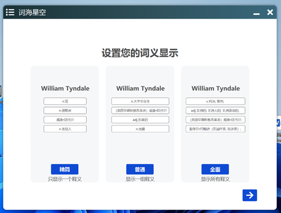
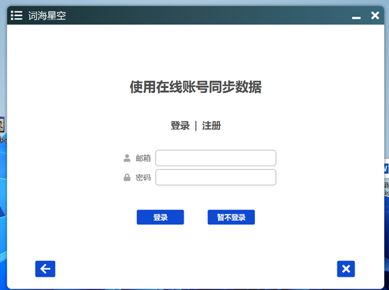
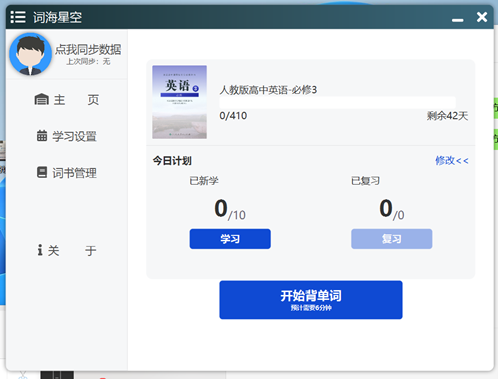
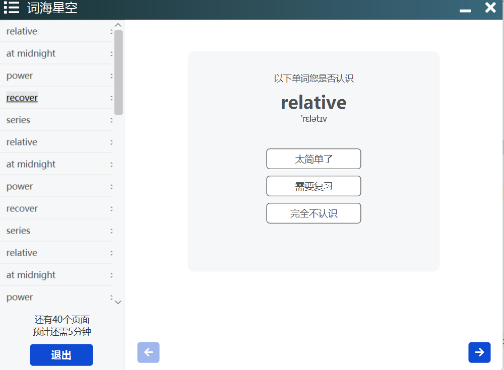

# 一款简单的背单词软件

## 作品简介

本项目前端采用Javafx，后端采用JDK的HttpServer。

这款背单词软件是一款简单实用的学习工具，致力于帮助用户有效地背诵单词，拓展词汇量。主要功能涵盖添加词书、设置学习计划、单词背诵和数据同步等功能。用户可以根据个人需求自定义词书，设定学习计划，利用专门的背诵界面进行单词学习，并实现数据在多设备间的同步。通过这款软件，用户可以轻松高效地进行单词学习，提升语言水平。

这是[Patrick](https://github.com/Patrick16262)的第一个项目，尽管制作略显粗糙，设计有些混乱，存在一些小bug，但展现出了作者的努力和学习进步。期待未来版本的改进和完善。

## 主要功能

添加词书：允许用户添加自定义的词书，便于管理和学习单词。

设置计划：用户可以设定学习计划，包括每天学习的单词数量、学习时长等，帮助用户有条不紊地进行单词背诵。

单词背诵：提供专门的背诵界面，展示单词及其释义，支持单词的朗读和记忆。

数据同步：实现数据的同步功能，可以在多个设备之间同步用户的学习进度和词书内容，确保用户的学习数据不丢失。

## 软件截图

新手引导：选择词义显示格式

新手引导：选择词书

新手引导：登录在线账号

主界面：

选词界面:

背诵界面:
